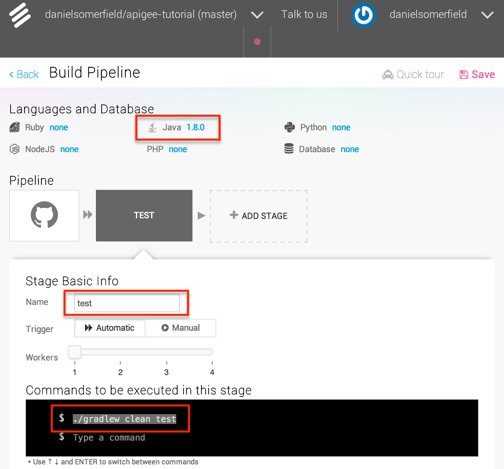
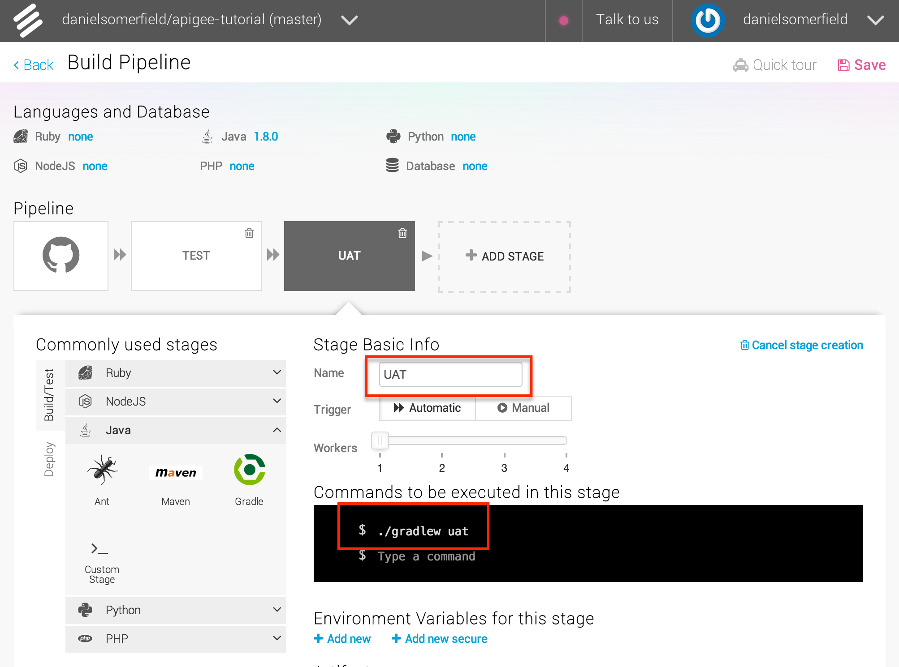

In [the last section](1-write-your-service.html), we finished the basic application, along with tests. Now we want to make sure we have continuous integration in place, so it's obvious if I break something when refactoring or enhancing the application.

Some people would recommend setting up a continuous delivery pipeline before writing the first line of code, and I think there is merit in that approach, but from my experience, that isn't how things work. Developers have mucked around locally for a while and then they decide (or are told) to run this through a CI pipeline. If you have written solid tests that run with a simple command, then you won't have to change much to integrate with CI, or even CD.

As I mentioned in the intro, there might be better options out there that would allow you to define your pipeline via artifacts that are checked into github, but this is quick and easy. If I was doing a full-blow CD project, I'd probably recommend using Go, or customized TeamCity or Jenkins installations, so you could auto-provision everything and have all configuration safely stored and versioned in your SCM repo.

All that said, we are where we are, so let's move it to Snap CI.

### Basic CI pipeline ###
First we'll just set up Snap to build and run unit tests. Log into Snap and you should see your list of builds, possibly empty. You can create a new one by clicking `+ Repository`. This will bring up a list of repos from your github account. Choose one, and after a few minutes you will have a bare bones pipeline established. To set up the initial pipeline, do the following
- Make sure that the Java version is set to 1.8
- Modify the first step in the pipeline to be **Test**
- Set the commands for the **Test** step to be `./gradlew clean test`
- Click `Save` and you have a pipeline, albeit a simple one.

Once you have saved it, the pipeline will run and it should pass. If it doesn't, you can look at the logs and see why not.

### A Brief Philosophical Degression ###
This is all well and good, but it isn't exactly comprehensive. At this point, we really need the automation running the full UAT. In fact, that's the point: if this were more complete application with many UA tests, running the UAT could take a long time. we might not want to have to run it at every check in. If we trust the completeness of our unit and integration tests, then we can run those locally and commit and trust that if we did anything dumb, the UA tests will catch it. At the risk of getting to deep in the philosophy of CI/CD: the point of the pipeline is to have a series of steps of increasing "investment", investment of time, investment of resources. As we progress down that path, layers of tests assert, in effect, that we am willing to make a greater investment and proceed to the next step, the final step being live code in production (with all caveats about blue/green and canary deployments acknowledged) being used by my customers. Which is why this one step pipeline isn't very useful.

So let's make it better.

### Improving the UAT Task ###
In order to run the UAT, we need to make our `uat` task self-contained, so we don't have to have a separate step to spin up the application. In order to do so, we can modify the `doFirst` task to do just that. Admittedly, this is where we pay a bit of a cost for not using a deployable. At this point, if we had a web app, we could do this with the build in jetty task, cargo, or the third party tomcat app.

But we don't and so we're going to build it. In short what I am want to do is this:

- Launch the Java app in an external process
- Wait to make sure the app is up
- Run the tests
- Whether they pass or fail, kill the app

#### Launching and Tearing Down
Unfortunately gradle doesn't give much to do an async application launch, but it gives enough information that we can do it ourselves with Java's `ProcessBuilder` class and the scripts that gradle generates for us. To do the teardown, we can create a task that will run after the UAT, whether it passes or fails. Gradle gives us `finalizedBy` for this purpose.


...
task uat(type: Test, dependsOn: ['test', 'copyDeps']) {
  include '**/*UATest.*'
  doFirst {
    startApp()
  }
}
uat.finalizedBy("cleanup")

task cleanup() {
  doFirst {
    stopApp()
  }
}

task extractDistro(type:Copy, dependsOn: 'distZip') {
  from(zipTree("build/distributions/${project.name}-${project.version}.zip"))
  into 'build/exploded'
}

def stopApp() {
  if (ext.process != null) {
    logger.info("Killing the app")
    ext.process.destroy()
  }
}

def startApp() {
  logger.info("Starting the app")
  ProcessBuilder builder = new ProcessBuilder("build/exploded/${project.name}-${project.version}/bin/${project.name}")
  builder.inheritIO()
  ext.process = builder.start()
}
...

*[View the full file on GitHub](https://github.com/danielsomerfield/apigee-tutorial/blob/setup-snap-ci/build.gradle)*

Now the app will start on its own before running the tests. And when it's done, it will be killed. The added dependency on `jar`, and `extractDistro` to the `uat` task ensure that both the app and all its dependencies are available for launching. The `extractDistro` simply tears open the distribution zip that is created by the `distZip` target we call implicitly by making it a dependency. It seems like a lot of overhead to create zip, then tear it open, but we're going to use that later. That zip is going to be come our final tested and deployed artifact.

So here's the thing. If you run the `uat` task now, it *might* work. The app will start, but because it is starting asynchronously, it might or might not be completely started by the time the tests run. Most likely that will mean flakey test runs. We could add a big fat delay at the beginning, but that feels unpredictable, so I am going to add a feature that will block the test run until I believe the application is alive and run the tests at that point. If it isn't up after a certain amount of time, I will assume it crashed and abort the run.

#### Waiting for the app to run
I like services to have health checks, so adding one for this purpose doesn't really feel like extra work. And it's really easy. We're going going to *ping* that health check from the build script. The changes to the build will look like this:

...

buildscript {
  repositories {
    mavenCentral()
  }

  dependencies {
    classpath 'org.apache.httpcomponents:httpclient:4.3.6'
  }
}

task uat(type: Test, dependsOn: ['test', 'extractDistro']) {
  include '**/*UATest.*'
  doFirst {
    startApp()
    waitForPing()
  }
}
uat.finalizedBy("cleanup")

def waitForPing() {
  def url = System.getProperty("HELLO_SERVICE_ROOT") ?: "http://localhost:8080";
  waitUntil(5000) {
    if (!ext.process.isAlive()) {
      throw new GradleException("The server process died with return code ${ext.process.exitValue()}")
    }
    ping("$url/ping/")
  }
}

def ping(String url) {
  try {
    HttpGet get = new HttpGet(url)
    HttpClients.createDefault().withCloseable() { client ->
      client.execute(get).withCloseable() { response ->
        return response.statusLine.statusCode == 200
      }
    }
  }
  catch (IOException ignored) {
    return false;
  }
}

def waitUntil(long maxWait, Closure closure) {
  long timeout = System.currentTimeMillis() + maxWait;

  while (System.currentTimeMillis() < timeout) {
    if (closure() == true) {
      return
    }
    Thread.sleep(500)
  }
  throw new GradleException("Wait for expected condition timed out.")
}
...

*[View the full file on GitHub](https://github.com/danielsomerfield/apigee-tutorial/blob/setup-snap-ci/build.gradle)*

First we add a `buildscript` section. This allows us to add repos and dependencies to the build script itself. Since we are going to use the Apache HTTP client libraries, that is what we want add to the classpath. We add the wait to the `doFirst` closure of the UAT task so that it blocks until the ping has been successful. The wait itself is simply a matter of running an HTTP GET until either a 200 code is returned or 5000 milliseconds has passed. Pretty simply stuff. Admittedly, the build script is starting to get a little ugly, so we could move the utility functions into an external plugin, or into the buildSrc directory of the tree, but for now, we'll leave it where it is and move them out if we need them somewhere else or the mess becomes unbearable.

If you run `./gradlew uat` at this point, it will fail with the message *"Wait for expected condition timed out."* We need to write the endpoint that responds to the ping. In doing that, We'll do a little refactoring on the way. We have good tests we can run--the old way if necessary--to make sure we don't break anything, so it's worth the investment.


...
class HelloServer {

  def HandlerCollection getHandlers() {
    HandlerCollection collection = new HandlerCollection();
    addHandlerWithContext(collection, "/hello", createHelloHandler())
    addHandlerWithContext(collection, "/ping", createPingHandler());
    return collection;
  }

  def static addHandlerWithContext(HandlerCollection collection, String context, Handler handler) {
    ContextHandler contextHandler = new ContextHandler(context)
    contextHandler.setHandler(handler)
    collection.addHandler(contextHandler)
  }

  def static createPingHandler() {
    { final String target, Request baseRequest,
      final HttpServletRequest request,
      final HttpServletResponse response ->
      response.setContentType("application/json")
      baseRequest.setHandled(true)
    } as AbstractHandler
  }
  ...
}


*[View the full file on GitHub](https://github.com/danielsomerfield/apigee-tutorial/blob/setup-snap-ci/src/main/groovy/helloService/HelloServer.groovy)*

Super simple. Just added a new handler at "/ping" that always returns a 200. Make sure you kill the old server process if it's still running so it doesn't give you false positives, and run it again:

╰─➤  ./gradlew clean uat
:clean
:compileJava UP-TO-DATE
:compileGroovy
:processResources UP-TO-DATE
:classes
:copyDeps
:jar
:compileTestJava UP-TO-DATE
:compileTestGroovy
:processTestResources UP-TO-DATE
:testClasses
:test
> Building 85% > :uat2015-01-04 13:53:15.478:INFO:oejs.Server:jetty-8.1.16.v20140903
2015-01-04 13:53:15.511:INFO:oejs.AbstractConnector:Started SelectChannelConnector@0.0.0.0:8080
:uat
:cleanup

BUILD SUCCESSFUL

Total time: 6.598 secs


Hopefully you will see something like the above, meaning all is well.

### Improving the Pipeline ###
*Finally* with all that done, we can enhance the pipeline. Back on Snap, we add the uat stage to my pipeline and then run it.

Now you are running your UAT in your build pipeline! If you have any doubt, introduce a breaking change and watch the build go red.

It's time to move from continuous integration to continuous delivery. In the next section, we push the app to our deployment target.

## [Continue to "Section 5: Automated Deployment"](5-automated-deployment.html) ##
