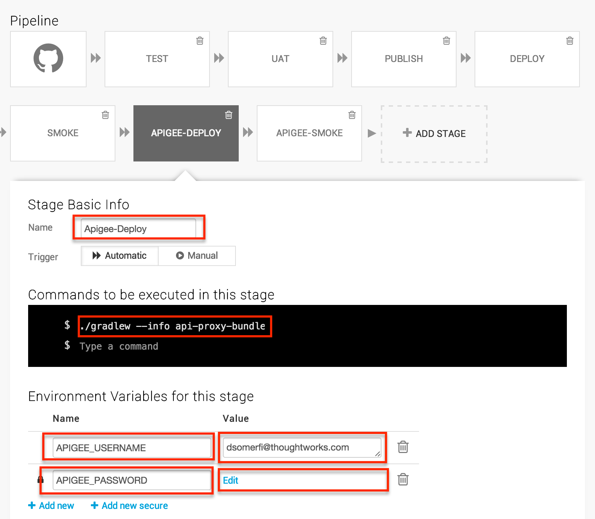
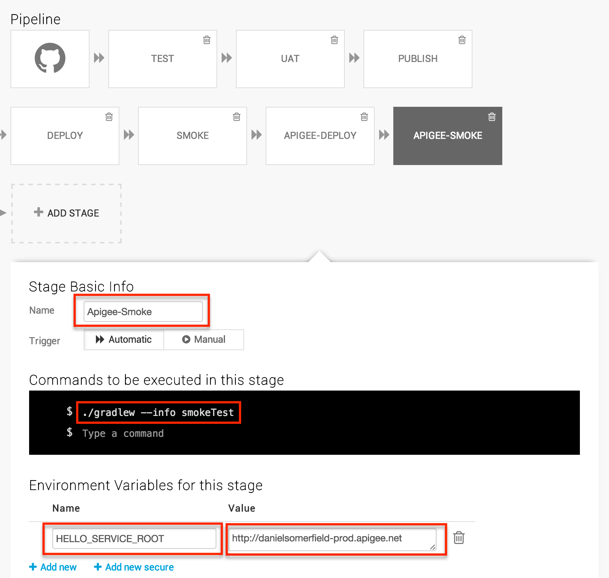

In [the last section](5-automated-deployment.html), we finished up our continuous delivery pipeline. Now, at long last, we start on Apigee. Apigee. Apigee offers very specific services for very specific circumstances. The API mangement platform, for example, is appropriate for situations where you have an internal service that you want to expose outside and you want to use a SAAS provide for exposing those services to the outside world. Apigee can provide rate limiting, authentication, monitization, so you don't have to build them yourself.

In my opinion, one of Apigee's real strengths is that everything is exposed by a series of REST APIs, making the service very continuous delivery friendly. In this section, we are going to put Apigee in front of our service, using our CD pipeline to do it.

## Apigee in Front ##
Our first iteration will simply add an Apigee "API proxy" to our application. You can use all the UIs to configure your API proxy but, of course, we're not going to do that. Instead, we're going to create a "api proxy bundle" that, when deployed, will tell Apigee how we want our proxy to work.

### Building the Bundle ###

In order to keep things organized, we're going to put the resources for the api proxy in a sub-project called `api-proxy-bundle'. The structure of the subproject looks like this:

  api-proxy-bundle/
    src/
      main/
        config/
          apiproxy/
            proxies/
              default.xml
            targets/
              default.xml
            apigee-tutorial.xml
    build.gradle


First let's look at the new `build.gradle` that defines the Apigee deployment tasks.

  apply plugin: "groovy"

  task distZip(type:Zip) {
    from "src/main/config"
  }

  task deploy(dependsOn: 'distZip') {
    doFirst {
      ApigeeUtils.deployToApigee(version)
    }
  }

*[View the full file on GitHub](https://github.com/danielsomerfield/apigee-tutorial/blob/apigee-deployment/api-proxy-bundle/build.gradle)*

All we are doing in this project is bundling up the xml files and creating a zip. Then we defer to the utility scripts for the actual deployment process. The files themselves are also very simple. The xml file in the root directory defines the Apigee proxy. The name of the file is the name of the application as we will define it in the deployment API calls.

  <APIProxy name="apigee-tutorial">
    <Description>Apigee Tutorial</Description>
  </APIProxy>

*[View the full file on GitHub](https://github.com/danielsomerfield/apigee-tutorial/blob/apigee-deployment/api-proxy-bundle/src/main/config/apiproxy/apigee-tutorial.xml)*

Proxies need endpoints, and those are defined in unfortunately named `proxies` directory. Here we create `default.xml' that defines the inbound interface for the proxy. The name of the file can be changed in the proxy definition file we just created, but we'll go with the default.


  <ProxyEndpoint name="default">
    <HTTPProxyConnection>
      <BasePath>/</BasePath>
      <VirtualHost>default</VirtualHost>
    </HTTPProxyConnection>
    <RouteRule name="default">
      <TargetEndpoint>default</TargetEndpoint>
    </RouteRule>
  </ProxyEndpoint>

*[View the full file on GitHub](https://github.com/danielsomerfield/apigee-tutorial/blob/apigee-deployment/api-proxy-bundle/src/main/config/apiproxy/proxies/default.xml)*

This says, in summary, *define a new client-facing endpoint on the default virtual host (we'll see why this is important later), and default path and route it according to the default route rule. That reference rule is then defined in "targets/default.xml"


  <TargetEndpoint name="default">
    <Description>Target for the apigee CD tutorial</Description>
    <HTTPTargetConnection>
      <!-- Change this next one to your heroku endpoint -->
      <URL>http://apigee-tutorial.herokuapp.com/</URL>
    </HTTPTargetConnection>
  </TargetEndpoint>

*[View the full file on GitHub](https://github.com/danielsomerfield/apigee-tutorial/blob/apigee-deployment/api-proxy-bundle/src/main/config/apiproxy/targets/default.xml)*

Again, pretty simple stuff. It defines a default target that forwards to your heroku URL.

Now if we run `api-proxy-bundle:deploy`, it will zip everything up in a nice little bundle. This bundle will be shipped off to apigee by the following code, called by the deploy task:

### Deploying the Bundle ###



def static deployToApigee(String version) {
  def proxyBundleName = "api-proxy-bundle-${version}.zip"
  HttpPost post = new HttpPost("https://api.enterprise.apigee.com/v1/o/danielsomerfield/apis?action=import&name=apigee-tutorial")
  post.addHeader("Content-Type", "application/octet-stream")
  post.setEntity(new FileEntity(new File("api-proxy-bundle/build/distributions/$proxyBundleName"), "binary/octet-stream"))
  def response = doHttpRequest(post)
  HttpPost deployPost = new HttpPost("https://api.enterprise.apigee.com/v1/o/danielsomerfield/environments/prod/apis/apigee-tutorial/revisions/${response.revision}/deployments?override=true")
  deployPost.addHeader("Content-type", "application/x-www-form-urlencoded")
  doHttpRequest(deployPost)
}

def static doHttpRequest(HttpUriRequest request) {
  String username = validate("APIGEE_USERNAME")
  String password = validate("APIGEE_PASSWORD")

  CredentialsProvider credsProvider = new BasicCredentialsProvider();
  credsProvider.setCredentials(
    new AuthScope(null, -1),
    new UsernamePasswordCredentials(username, password));

    HttpClients.custom()
    .setDefaultCredentialsProvider(credsProvider)
    .build().withCloseable() { client ->
      CloseableHttpResponse response = client.execute(request)
      if (response.statusLine.statusCode < 200 || response.statusLine.statusCode >= 300) {
        throw new GradleException("Deploy failed with response code ${response.statusLine.statusCode}")
      }

      response.getEntity().content.withCloseable { i ->
        return new JsonSlurper().parse(new InputStreamReader(i))
      }
    }
  }

  def static validate(String varName) {
    String value = System.getenv(varName);
    if (!value) throw new InvalidUserDataException("Missing required environment variable '$varName'")
    value
  }

*[View the full file on GitHub](https://github.com/danielsomerfield/apigee-tutorial/blob/apigee-deployment/buildSrc/src/main/groovy/ApigeeUtils.groovy)*

The `deployToApigee` function posts this zip file to Apigee via https, then makes a second call to enable the revision in the "production" environment. If you are doing testing that includes the Apigee layer, you would probably want to deploy to the "test" environment and promote when testing is complete. That second REST call would be the mechanism you would use to do so.

There are lots of opportunities to refactor this code, including removing some of the hard-coding and extracting the HTTP client calls, but for now we'll leave it as is.

### Updating the Pipeline ###
Since we now have a new hop between the user and the service, but we haven't changed the application behavior, we can simply re-use our smoke test against the new Apigee endpoint. Back at Snap, we'll add two more steps to our pipeline, one to deploy to Apigee, and one to do the smoke test. You will notice that the Snap UI doesn't handle a pipeline this long particularly gracefully. I expect they don't anticipate so many steps in the pipeline. For your pipeline, you will have to decide whether to collapse some of these steps. I am disinclined to do so because having this many steps enables knowing instantly where a problem lies. And, if we assume there is additional cost for each new resources we integrate, then a highly granular pipeline minimizes the cost of a failure.

The Apigee deploy step won't look dramatically different than a number of other steps we have created. We call a gradle task with some environmental variables set.

The final step is the smoke test step through Apigee. The only difference with the previous smoke test is the `HELLO_SERVICE_ROOT` environmental variable which directs it to hit proxy end point we defined above.

So now we are running through Apigee, everything in the entire service stack is automated and we can make changes without fear that we are breaking something along the line. Imagine at this point that we decide our hello service is much too important to allow just *anybody* to use. So let's lock it down.

## [Continue to "Section 7: Locking it Down"](7-locking-it-down.html) ##

*We will work more with the Apigee APIs in the coming sections, but if you want a preview, you can learn more about configuring proxies in the [Apigee API Proxy Configuration Reference](http://apigee.com/docs/api-services/reference/api-proxy-configuration-reference).*
